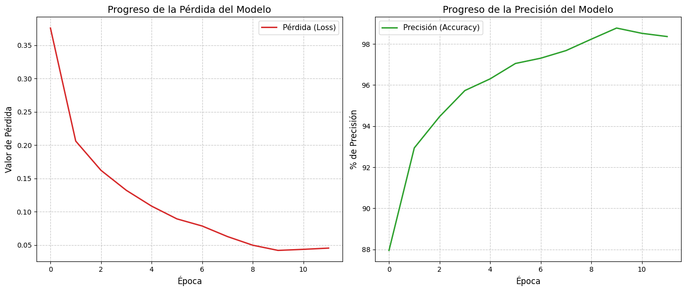
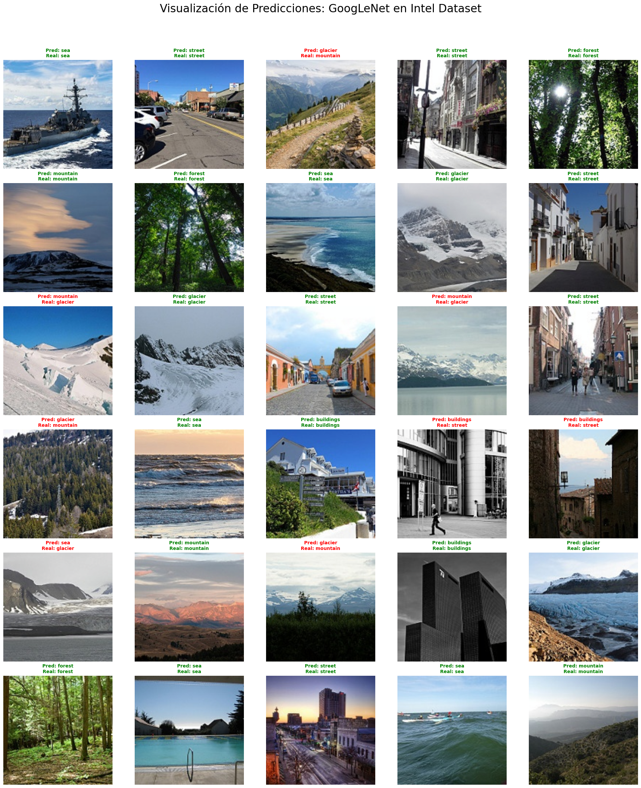

# Clasificación de Escenas Naturales mediante Transfer Learning con GoogLeNet

## Descripción

Este proyecto implementa un sistema de clasificación de imágenes utilizando la arquitectura GoogLeNet preentrenada y técnicas de Transfer Learning en PyTorch.

El objetivo es clasificar imágenes de escenas naturales en seis categorías diferentes utilizando un modelo convolucional previamente entrenado sobre ImageNet y posteriormente ajustado (fine-tuning) para una nueva tarea de clasificación.

## Objetivos

- Aplicar técnicas de Transfer Learning en visión por computadora.
- Adaptar una red neuronal convolucional preentrenada a un nuevo problema.
- Evaluar el desempeño de GoogLeNet sobre un conjunto de imágenes de escenas naturales.
- Analizar el comportamiento del entrenamiento mediante métricas y visualizaciones.

---

## Dataset

Se utilizó el dataset **Intel Image Classification**, disponible en Kaggle:

https://www.kaggle.com/datasets/puneet6060/intel-image-classification

El conjunto de datos contiene aproximadamente 25,000 imágenes distribuidas en seis categorías: 

- Buildings
- Forest
- Glacier
- Mountain
- Sea
- Street

El dataset se encuentra dividido en conjuntos de entrenamiento y prueba.

---

## Metodología

### 1. Preprocesamiento

Las imágenes son transformadas mediante:

- Redimensionamiento a 224 × 224 píxeles.
- Volteo horizontal aleatorio de imágenes (Random Horizontal Flip).
- Rotación aleatoria (Random Rotation).
- Conversión a tensor.
- Normalización utilizando los parámetros estándar de ImageNet.

Estas transformaciones permiten mejorar la capacidad de generalización del modelo y reducir el sobreajuste.

### 2. Transfer Learning

Se empleó la arquitectura GoogLeNet preentrenada sobre ImageNet.

La capa de clasificación final fue reemplazada para adaptarla al número de clases del dataset:

```python
model = models.googlenet(weights='DEFAULT')
model.fc = nn.Linear(model.fc.in_features, len(train_dataset.classes))
```

Posteriormente se realizó fine-tuning de todos los parámetros del modelo utilizando PyTorch para adaptarlo al conjunto de datos de escenas naturales.

### 3. Entrenamiento

Configuración utilizada:

- Función de pérdida: CrossEntropyLoss
- Optimizador: Adam
- Tasa de aprendizaje (Learning Rate): 0.0001
- Tamaño de lote de imágenes (Batch Size): 32
- Entrenamiento sobre GPU cuando está disponible

Durante el entrenamiento se registran:

- Pérdida (Loss)
- Exactitud (Accuracy)

Además, se guardan automáticamente los mejores pesos obtenidos.

### 4. Evaluación

El modelo entrenado se evalúa sobre el conjunto de prueba.

Las métricas consideradas incluyen:

- Exactitud global (Accuracy)
- Visualización de predicciones
  
---

## Resultados

El modelo alcanzó una exactitud del **92.60%** sobre el conjunto de prueba.

Durante el entrenamiento se registraron las curvas de pérdida y exactitud, permitiendo monitorear el proceso de aprendizaje del modelo.

El notebook genera:

- Evolución de la pérdida durante el entrenamiento.
- Evolución de la exactitud durante el entrenamiento.
- Visualización de predicciones correctas e incorrectas sobre imágenes del conjunto de prueba.

### Curva de exactitud



### Curva de pérdida



---

## Tecnologías Utilizadas

- Python
- PyTorch
- Torchvision
- NumPy
- Matplotlib
- Scikit-Learn
- PIL

---

## Estructura del Proyecto

```text
.
├── gNET.ipynb
├── README.md
```

---

## Instalación

Clonar el repositorio:

```bash
git clone https://github.com/munlopezi-lab/googlenet-transfer-learning.git
```

---

## Ejecución

Abrir el notebook:

```bash
jupyter notebook gNET.ipynb
```

Ejecutar las celdas en orden para:

1. Cargar los datos.
2. Entrenar el modelo.
3. Evaluar resultados.
4. Visualizar predicciones.

---

## Aprendizajes

Este proyecto permitió aplicar conceptos de:

- Redes Neuronales Convolucionales (CNNs).
- Transfer Learning.
- Fine-Tuning de modelos preentrenados.
- Clasificación multiclase de imágenes.
- Evaluación y visualización de modelos de Deep Learning.
- Uso de PyTorch para tareas de visión por computadora.

---

> **Nota:** El dataset no se incluye en este repositorio debido a su tamaño. Puede descargarse directamente desde Kaggle mediante el enlace proporcionado anteriormente.

## Autor

Jairo Isaac Muñoz López

Estudiante de Licenciatura en Matemáticas Aplicadas.

GitHub: https://github.com/munlopezi-lab
